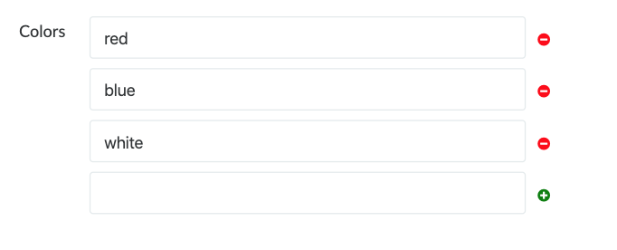
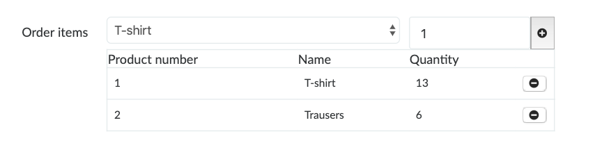

# Custom Inputs for Formtastic (Active Admin)

I've been using [Active Admin](https://github.com/activeadmin/activeadmin) for developing admin panels for my clients.
There are number of custom input components accumulated along the way. 

I've decided to make a gem and share all these custom input components that I think may be very useful.

   
These inputs are optimised for [Arctic Admin](https://github.com/cprodhomme/arctic_admin) theme. 
If you are using any other theme you can ignore the css files of this gem and implement your own css. 

*Note:* Although these inputs are being actively used in a production app you should use them at your own risk.

- [Array input](#array-input)
- [List input](#list-input)


(More to come...)
- Code Editor input (...)
- Query Builder input (...)
- Remote Image Select input (...)
- Rich Text input (...)
- Upload To S3 input (...)

## Installation

Add this line to your application's Gemfile:

```ruby
gem 'custom_inputs'
```

And then execute:

    $ bundle

Or install it yourself as:

    $ gem install custom_inputs

## Usage

All inputs comes with a javascript and scss file. You need to include these files wherever and whenever you want them to be included.

For a quick start you can add them to the base active admin asset files like so:


Append @ app/assets/javascripts/active_admin.js:
```javascript 
    //= require custom_inputs/array-input
    //= require custom_inputs/list-input
``` 

Append @ app/assets/stylesheets/active_admin.scss :
```scss 
    @import "custom_inputs/array_input";
    @import "custom_inputs/list_input";
``` 

### Array Input

Array input is specially made for PostgreSQL array fields.
You can add/remove string items to the input and they'll be packed in an array field.

Add the field to the permitted parameter as an array.
```ruby
permit_params  colors: []
```

```ruby
  form do |f|
    f.inputs do
      f.input :colors, as: :array, undoable: true
    end
    f.actions
  end
```

#### Available Options

- **`undoable`:** deleted array items can be un-deleted if this flag set to true.   

### List Input


List input helps you generate a selection of items (array of hashes) from the supplied `collection_object` option.

You can select items from a drop down list, with an optional quantity. 

The selected items are displayed in an html table. 

You can determine which fields of the items are to be used by `fields` option.  

This input will eventually generate an array of hashes with specified fields to be submitted.
  

```ruby
form do |f|
    f.inputs do
      f.input :order_items, as: :list,
              has_quantity: true,
              collection_object: Product.all,
              to_s_method: :name,
              unique_field: :id,
              fields: [
                  {'Product number': :id},
                  {'Name': :name}
              ]
    end
    f.actions
  end
```
#### Available Options

- **`has_quantity`:** append quantity field to the items in the list.
- **`collection_object*`:** the list of items to choose from. 
- **`to_s_method`:** (default `to_s`) the method to call for each item in the `collection_object` to display it in the dropdown list.
- **`unique_field`:** (default `id`) the field that uniquely identifies the items in the `collection_object`.    
- **`fields*`:** only the supplied fields of the items will be used in the input. 
The keys are used as table column headers and the values ara the actual field names.   
 

## Contributing

Bug reports and pull requests are very welcome.

## License

The gem is available as open source under the terms of the [MIT License](https://opensource.org/licenses/MIT).
